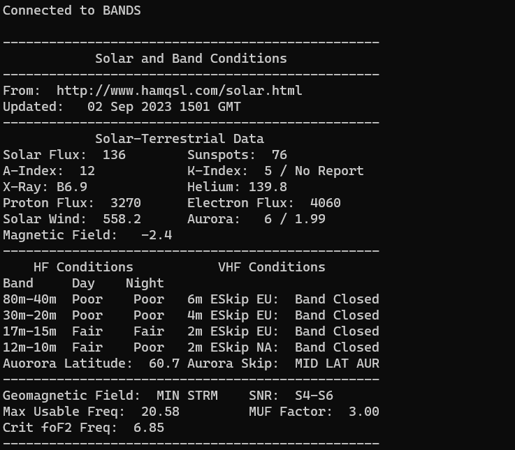
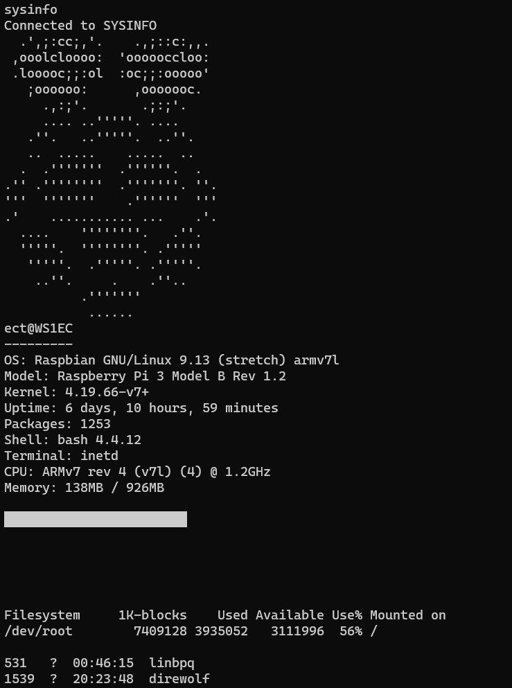
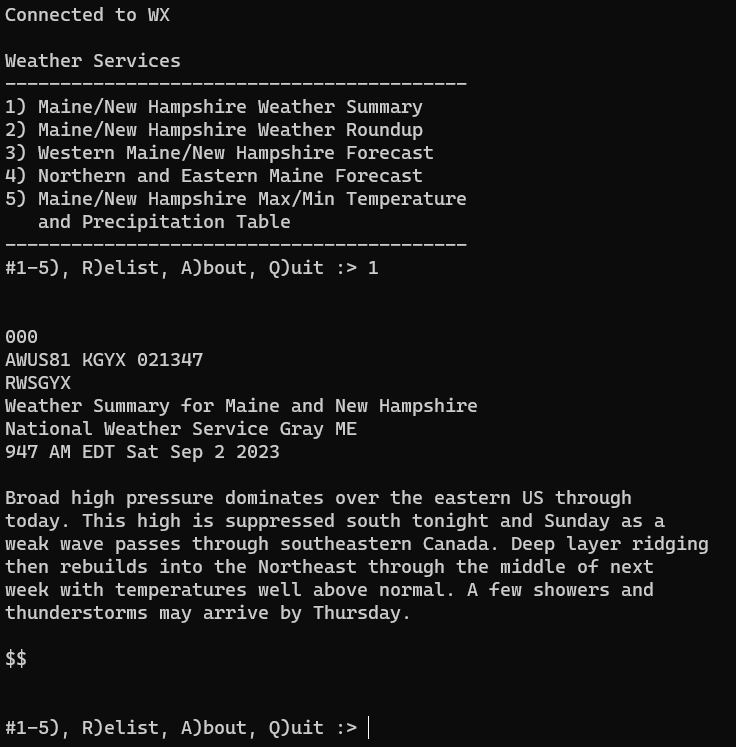

# BBS Apps
Applications designed to run via BPQ BBS APPLICATION commands or standalone.

## Table of Contents
- [Features](#features)
- [Applications](#applications)
  - [feed.py](#feedpy)
  - [calendar.py](#calendarpy)
  - [callout.py](#calloutpy)
  - [forms.py](#formspy)
  - [ai.py](#aipy)
  - [gopher.py](#gopherpy)
  - [hamqsl.py](#hamqslpy)
  - [hamtest.py](#hamtestpy)
  - [predict.py](#predictpy)
  - [qrz3.py](#qrz3py)
  - [rss-news.py](#rss-newspy)
  - [space.py](#spacepy)
  - [wx.py](#wxpy)
  - [wx-me.py](#wx-mepy)
  - [wxnws-ftp.py](#wxnws-ftppy)
- [Installation](#installation)
- [BPQ Configuration](#bpq-configuration)

## Features

**🔄 Automatic Updates**: All applications automatically check for updates on startup. When a newer version is available on GitHub, it will be downloaded and installed automatically. The check has a 3-second timeout to ensure fast startup even without internet connectivity.

**📻 Packet Radio Optimized**: Designed for low-bandwidth AX.25 packet radio with:
- Plain ASCII text output (no ANSI codes or Unicode)
- Minimal data usage
- 80-column terminal compatibility
- Simple command-based navigation
- Fast startup and response times

## Applications

feed.py
-----------
**Type**: Python  
**Purpose**: Community message feed for posting and viewing one-liner messages  
**Information source**: User submissions stored locally  
**Developer**: Brad Brown KC1JMH  
**Notes**: Twitter-style message feed door application. Messages stored in JSON format with callsign, timestamp, and message text. Automatically captures user callsign from BPQ32.

**Download or update**:  
```wget -O feed.py https://raw.githubusercontent.com/bradbrownjr/bpq-apps/main/apps/feed.py && chmod +x feed.py```

**Features**:
- Post one-liner messages (up to 80 characters)
- View recent messages with pagination (10 messages per page)
- Delete your own messages

calendar.py
-----------
**Type**: Python  
**Purpose**: Display ham radio club events from iCalendar feeds  
**Information source**: Online .ics files (iCalendar format)  
**Developer**: Brad Brown KC1JMH  
**Notes**: Fetches and displays upcoming club meetings, nets, and activities from iCalendar URLs. Internet-optional with graceful offline fallback.

**Download or update**:  
```wget -O calendar.py https://raw.githubusercontent.com/bradbrownjr/bpq-apps/main/apps/calendar.py && chmod +x calendar.py```

**Features**:
- Prompts for iCal URL on first run, saves to calendar.conf
- View upcoming events (next 90 days) or all events
- Displays event date/time, location, and description
- Handles multi-day and all-day events
- Refresh calendar on demand
- Text wrapping optimized for packet radio bandwidth (40-char terminal width)
- Offline detection with user-friendly error messages
- Automatic update functionality

**BPQ32 Configuration**:
```
APPLICATION 7,CALENDAR,C 9 HOST 7 K
```

**Usage**:
- U: View upcoming events (next 90 days)
- A: View all events in calendar
- R: Refresh calendar from URL
- C: Change calendar URL
- Q: Quit

**First Run**:
App prompts for iCal URL and saves it to `calendar.conf` for future use.

**Data Storage**:
Configuration stored in `calendar.conf` in same directory as script:
```json
{
  "ical_url": "https://example.com/calendar.ics"
}
```

callout.py
----------
---------
**Type**: Python  
**Purpose**: Gopher protocol client for accessing gopherspace  
**Information source**: Gopher servers worldwide  
**Developer**: Brad Brown KC1JMH

**Download or update**:  
```wget -O gopher.py https://raw.githubusercontent.com/bradbrownjr/bpq-apps/main/apps/gopher.py && chmod +x gopher.py```

hamqsl.py
---------
**Type**: Python  
**Purpose**: HF Propagation  
**Information source**: www.hamqsl.com, used by permission of author Paul N0NBH  
**Developer**: Brad Brown KC1JMH

**Download or update**:  
```wget -O hamqsl.py https://raw.githubusercontent.com/bradbrownjr/bpq-apps/main/apps/hamqsl.py && chmod +x hamqsl.py```



hamtest.py
----------
**Type**: Python  
**Purpose**: Ham radio license test practice application  
**Information source**: russolsen/ham_radio_question_pool GitHub repository  
**Developer**: Brad Brown KC1JMH  
**Notes**: Automatically downloads current question pools from GitHub. Python 3.5+ required.

**Download or update**:  
```wget -O hamtest.py https://raw.githubusercontent.com/bradbrownjr/bpq-apps/main/apps/hamtest.py && chmod +x hamtest.py```

**Features**:
- Practice tests for Technician, General, and Extra class licenses
- Realistic exam simulation with proper question distribution
- Automatic question pool updates from GitHub
- ASCII art interface optimized for packet radio terminals
- Pass/fail scoring with 74% threshold
- Quit functionality during exams
- Credit attribution to original question pool author

**Usage**:
- Select license class from main menu
- Answer multiple choice questions (A, B, C, D)
- Press 'Q' during exam to quit back to menu

predict.py
----------
**Type**: Python  
**Purpose**: HF propagation estimator - best bands/times for contacts  
**Information source**: hamqsl.com solar data, simplified ITU-R ionospheric model  
**Developer**: Brad Brown KC1JMH  
**Notes**: Simplified model (~70-80% accuracy). For precise predictions, use voacap.com.

**Download or update** (from ~/apps directory):  
```cd ~/apps && wget -O predict.py https://raw.githubusercontent.com/bradbrownjr/bpq-apps/main/apps/predict.py && chmod +x predict.py```  
```mkdir -p predict && wget -O predict/__init__.py https://raw.githubusercontent.com/bradbrownjr/bpq-apps/main/apps/predict/__init__.py```  
```wget -O predict/geo.py https://raw.githubusercontent.com/bradbrownjr/bpq-apps/main/apps/predict/geo.py```  
```wget -O predict/solar.py https://raw.githubusercontent.com/bradbrownjr/bpq-apps/main/apps/predict/solar.py```  
```wget -O predict/ionosphere.py https://raw.githubusercontent.com/bradbrownjr/bpq-apps/main/apps/predict/ionosphere.py```  
```wget -O predict/regions.json https://raw.githubusercontent.com/bradbrownjr/bpq-apps/main/apps/predict/regions.json```

**Features**:
- Estimates best HF bands (80m-10m) and times for contacts
- Resilient solar data: online → cached → user input → defaults
- Location input: gridsquare, GPS, DMS, US state, country, callsign
- Callsign gridsquare lookup via HamDB API
- BPQ LOCATOR config integration
- Works offline with cached or user-supplied solar data

**Solar Data & Geomagnetic Conditions**:
Real-time solar indices from hamqsl.com determine band reliability:
- **K-Index (Geomagnetic)**: 0-9 scale measuring magnetosphere disturbance
  - K >= 7: SEVERE STORM (major HF degradation)
  - K >= 5: STORM (poor HF conditions)
  - K >= 4: UNSETTLED (degraded)
  - K < 2: QUIET (excellent conditions)
- **SSN (Sunspot Number)**: 0-300 scale, higher = better HF propagation
- **SFI (Solar Flux Index)**: Radiation intensity; affects band openings

**Usage**:
- Select prediction type from menu (me to ham, me to place, place to place)
- Enter locations as gridsquare, coordinates, state, country, or callsign
- View band reliability estimates and recommended frequencies

qrz3.py
- Use option 5 to manually update question pools

qrz3.py
-------
**Type**: Python  
**Purpose**: QRZ lookup  
**Information source**: qrz.com   
**Developer**: Modified code from github.com/hink/qrzpy  
**Notes**: Requires XML subscription and API key to download all available information, unless you are prompting visitors for their QRZ creds (in plaintext over the air or local)

**Download or update**:  
```wget -O qrz3.py https://raw.githubusercontent.com/bradbrownjr/bpq-apps/main/apps/qrz3.py && chmod +x qrz3.py```


rss-news.py
-----------
**Type**: Python  
**Purpose**: RSS feed reader with categorized feeds  
**Information source**: Configurable RSS feeds  
**Developer**: Brad Brown KC1JMH  
**Notes**: Requires rss-news.conf configuration file. Optionally uses w3m for better text extraction from web articles.

**Download or update**:  
```
wget -O rss-news.py https://raw.githubusercontent.com/bradbrownjr/bpq-apps/main/apps/rss-news.py && chmod +x rss-news.py
wget -O rss-news.conf https://raw.githubusercontent.com/bradbrownjr/bpq-apps/main/apps/rss-news.conf
```

**Features**:
- Categorized RSS feeds from configuration file
- Browse feeds by category and view article lists
- Article size warnings for bandwidth management
- Pagination support for large articles
- Clean text extraction from web pages
- Optional full article fetching from source URLs

**Configuration**:
Edit `rss-news.conf` to add your own RSS feeds in CSV format:
```
Category,Feed Name,Feed URL
```

callout.py
----------
**Type**: Python  
**Purpose**: Test application demonstrating BPQ callsign capture  
**Information source**: BPQ32 connection data  
**Developer**: Brad Brown KC1JMH  
**Notes**: Simple example showing how to capture the connecting user's callsign from BPQ32. Used as a reference for other applications.

**Download or update**:  
```wget -O callout.py https://raw.githubusercontent.com/bradbrownjr/bpq-apps/main/apps/callout.py && chmod +x callout.py```

**Features**:
- Captures callsign passed from BPQ32 via stdin
- Demonstrates configuration without NOCALL flag
- Shows how to use 'S' flag to strip SSID
- Reference implementation for other applications

**BPQ32 Configuration**:
```
APPLICATION 7,CALLOUT,C 9 HOST 3 S
```
The 'S' flag strips the SSID (e.g., KC1JMH-8 becomes KC1JMH). Remove 'S' to include SSID.

forms.py
--------
**Type**: Python  
**Purpose**: Fillable forms system for packet radio  
**Information source**: User input, form templates  
**Developer**: Brad Brown KC1JMH  
**Notes**: Generates BPQ-importable messages from completed forms. Automatically captures user callsign from BPQ32. Form templates are automatically downloaded from GitHub on first run.

**Download or update**:  
```
wget -O forms.py https://raw.githubusercontent.com/bradbrownjr/bpq-apps/main/apps/forms.py && chmod +x forms.py
```

**Features**:
- **Auto-downloads form templates from GitHub** - no manual wget needed for forms!
- Auto-discovery of form templates from `forms/` subdirectory
- Captures user callsign automatically from BPQ32 (or prompts if not available)
- User always specifies recipient for each form submission
- Optional form review before submission (saves bandwidth)
- **Strip Mode**: Parse and respond to slash-separated information request strips (MARS/SHARES format)
- Multiple field types: text (single-line), textarea (/EX terminated), yes/no/na, multiple choice
- Required and optional field validation
- Press Q to quit at any time during form filling
- Exports to BPQ message format for automatic import

**Included Forms**:
- ICS-213 General Message
- Net Check-in
- Equipment Status Report
- ARRL Radiogram
- Field Situation Report (FSR)
- Severe Weather Report (SKYWARN compatible)
- Bulletin Message
- ICS-309 Communications Log
- USGS Did You Feel It? (DYFI) Earthquake Report
- Information Strip Response (MARS/SHARES format)

**BPQ32 Configuration**:
```
APPLICATION 14,FORMS,C 9 HOST 10 S
```
Note: Does NOT use NOCALL flag, so callsign is passed to the application. The 'S' flag strips SSID.

**BPQ Import Setup**:
The forms application appends completed forms to a single file (`../linbpq/infile` relative to the forms.py script) in BPQ message format. To automatically import these messages into your BPQ BBS:

1. The export file will be: `linbpq/infile` (same directory as your bpq32.cfg)
2. In the BPQ32 web UI, configure a forwarding record to import from this file
3. Use the forwarding script command: `IMPORT infile DELETE`
4. The DELETE option removes the file after successful import

For manual import via web UI: **Actions → Import Messages** and select the infile.

**Creating Custom Forms**:
Form templates use JSON format with the following structure:
```json
{
  "id": "FORMID",
  "title": "Form Title",
  "version": "1.0",
  "description": "Form description",
  "fields": [
    {
      "name": "field_name",
      "label": "Field Label",
      "type": "text|textarea|yesno|choice",
      "required": true|false,
      "description": "Field description",
      "max_length": 100,
      "allow_na": true|false,
      "choices": ["Option 1", "Option 2"]
    }
  ]
}
```
Note: Recipient is always prompted from user after form completion.

**Field Types**:
- `text` - Single-line text input (press Enter to finish, can be left blank if not required)
- `textarea` - Multi-line text input (type `/EX` on new line to finish)
- `yesno` - Yes/No/NA response
- `choice` - Numbered list of options
- `strip` - Slash-separated MARS/SHARES format for information request/response

ai.py
-----
**Type**: Python  
**Purpose**: AI chat assistant for amateur radio operators  
**Information source**: Google Gemini API or OpenAI API  
**Developer**: Brad Brown KC1JMH  
**Notes**: Interactive AI chat with Elmer persona (ham radio mentor). Supports multiple AI providers with per-callsign preferences. Internet-required with graceful offline detection.

**Download or update**:  
```
wget -O ai.py https://raw.githubusercontent.com/bradbrownjr/bpq-apps/main/apps/ai.py && chmod +x ai.py
```

**Features**:
- Multiple AI providers: Google Gemini 2.5 Flash (free tier) or OpenAI GPT-4o Mini (paid)
- Per-callsign provider preference tracking
- Elmer persona - AI introduces itself as a ham radio mentor/teacher
- Personalized greetings using HamDB/QRZ operator name lookup
- Ham Radio Ten Commandments guidance for appropriate tone
- Explicit ASCII-only directive (no Unicode, emoji, or special characters)
- Brief responses optimized for 1200 baud packet radio (2-3 sentences max)
- Conversational memory within session (last 10 exchanges)
- Ham radio-appropriate sign-offs (73, Good DX, See you down the log)
- Transactional prompts - exit at any time with Q
- Internet connectivity check with graceful offline message
- Dynamic text wrapping (40-char fallback for packet radio)
- Automatic update functionality
- Token-optimized system prompts to avoid rate limits

**Setup**:
1. Configure at least one AI provider:
   - **Gemini (free)**: `./ai.py --config gemini`
     - Create project at https://aistudio.google.com/projects
     - Create API key at https://aistudio.google.com/api-keys
     - Enable Generative Language API (if prompted)
   - **OpenAI (paid)**: `./ai.py --config openai`
     - Sign up at https://platform.openai.com/signup
     - Create API key at https://platform.openai.com/api-keys
     - Choose "Service account" (not "You") and name it (e.g., bpq-api)
     - Add credits to account
     - **Set budget limit** at https://platform.openai.com/settings/organization/limits
       - Recommended: $10/month to prevent surprise bills
       - GPT-4o Mini costs ~$0.15 per 1M input tokens, ~$0.60 per 1M output tokens
       - Typical chat session: 100-200 tokens (~$0.00002-0.00004 per exchange)
2. On first connection, user selects preferred AI provider
3. Preference saved per callsign, auto-selected on return visits
4. Type 'switch' as first input to change providers

**BPQ32 Configuration**:
```
APPLICATION 15,AI,C 9 HOST 11 K
```
Note: Does NOT use NOCALL flag - callsign passed for personalized greetings and preference tracking. 'K' flag keeps session alive.

**Usage**:
- AI greets user immediately (confirms online status)
- Type questions or messages to chat with Elmer
- AI responds with ham radio context awareness
- Type Q, QUIT, EXIT, or BYE to end session (AI says goodbye)
- Conversation memory retained within single session

**Data Storage**:
API keys and per-user preferences stored in `ai.conf`:
```json
{
  "gemini_api_key": "your-gemini-key-here",
  "openai_api_key": "your-openai-key-here",
  "default_provider": "gemini",
  "ai_name": "Elmer",
  "user_preferences": {
    "KC1JMH": {
      "provider": "openai",
      "last_used": "2026-01-29"
    }
  }
}
```

**Sysop Configuration**:
- Set `default_provider` to "gemini" or "openai" to skip provider selection menu
- Set `ai_name` to customize AI assistant name (default: "Elmer")
- Without default_provider, users see menu on first connection
- Users can override sysop default by typing 'switch' during session
- Per-user preferences saved and auto-selected on return visits

**Sysop CLI Commands**:
```bash
./ai.py --set-name Hal          # Change AI name
./ai.py --set-default openai    # Set default provider
./ai.py --config gemini         # Configure API keys
```

space.py
--------
**Type**: Python  
**Purpose**: NOAA Space Weather reports  
**Information source**: Space Weather Prediction Center, National Oceanic and Atmospheric Administration  
**Developer**: Brad Brown KC1JMH

**Download or update**:  
```wget -O space.py https://raw.githubusercontent.com/bradbrownjr/bpq-apps/main/apps/space.py && chmod +x space.py```


sysinfo.sh
----------
**Type**: Shell script  
**Purpose**: Get host information and confirm BBS services are running  
**Information source**: localhost  
**Developer**: Brad Brown KC1JMH  
**Notes**: Requires neofetch be installed  

**Download or update**:  
```wget -O sysinfo.sh https://raw.githubusercontent.com/bradbrownjr/bpq-apps/main/apps/sysinfo.sh && chmod +x sysinfo.sh```



wx.py
-----
**Type**: Python  
**Purpose**: Interactive weather reports with alert checking via NWS API  
**Information source**: National Weather Service API  
**Developer**: Brad Brown KC1JMH  
**Notes**: Production-ready weather app. Uses NWS API to pull weather for any location with real-time alert detection. Requires `maidenhead` module for grid square conversions. Integrates with BPQ32 callsign passing (S flag).

**Download or update**:  
```wget -O wx.py https://raw.githubusercontent.com/bradbrownjr/bpq-apps/main/apps/wx.py && chmod +x wx.py```

**Features**:
- Interactive menu: Local weather, location lookup, callsign-based weather
- Real-time NWS weather alerts (Tornado, Severe Thunderstorm, Winter Storm, Wildfire, etc.)
- SKYWARN activation detection from Hazardous Weather Outlook (HWO)
- Callsign gridsquare lookup via HamDB (with auto-update from GitHub)
- Alert summary displayed in header on startup
- Dedicated menu option to view full alert details when alerts are active
- Supports user entry: gridsquare, GPS coordinates, or amateur radio callsign
- BPQ32 integration: Optional callsign passing via S flag for automatic lookup
- Offline fallback: Continues gracefully if internet unavailable
- Bandwidth optimized: 40-char width, minimal formatting for 1200-baud packet radio

**Status**: Production-ready (v1.4+)

wx-me.py
--------
**Type**: Python  
**Purpose**: Local weather reports for Southern Maine and New Hampshire  
**Information source**: National Weather Service, Gray Office  
**Developer**: Brad Brown KC1JMH  
**Notes**: Production version of weather app. Direct text file retrieval from NWS.

**Download or update**:  
```wget -O wx-me.py https://raw.githubusercontent.com/bradbrownjr/bpq-apps/main/apps/wx-me.py && chmod +x wx-me.py```



wxnws-ftp.py
------------
**Type**: Python  
**Purpose**: Retrieve NWS products via FTP  
**Information source**: NWS TGFTP server  
**Developer**: Brad Brown KC1JMH  
**Notes**: Experimental. Downloads and displays NWS text products from FTP server. Configurable region code.

**Download or update**:  
```wget -O wxnws-ftp.py https://raw.githubusercontent.com/bradbrownjr/bpq-apps/main/apps/wxnws-ftp.py && chmod +x wxnws-ftp.py```

**Features**:
- Downloads AFD (Area Forecast Discussion) files from NWS FTP
- Pauses at section breaks (&&) for user pacing
- Configurable regional NWS office

**Status**: Experimental, not production-ready.

## Subdirectories

### forms/
Contains form templates (.frm files) used by forms.py. Templates are automatically downloaded from GitHub on first run. See forms/ subdirectory README for form template format and available forms.

### question_pools/
Contains ham radio license exam question pools in JSON format. Automatically downloaded and updated by hamtest.py from russolsen/ham_radio_question_pool repository.

### images/
Screenshots and example output images for documentation.

**Note**: Sysop utilities for managing the BBS are located in `/utilities` at repository root.

# ToDos
[X] **All** - Update #! to call interpreter regardless of location using env  
[ ] **qrz3.py** - Add variable check so as to not require sysop to comment lines if used in the mode that requires user login  
[ ] **wx.py** - Expand to provide weather information for other areas, in the meantime the txt web requests may be updated to pull any URL.

## Configuration

See [../docs/examples/](../docs/examples/) for inetd and bpq32.cfg configuration examples.