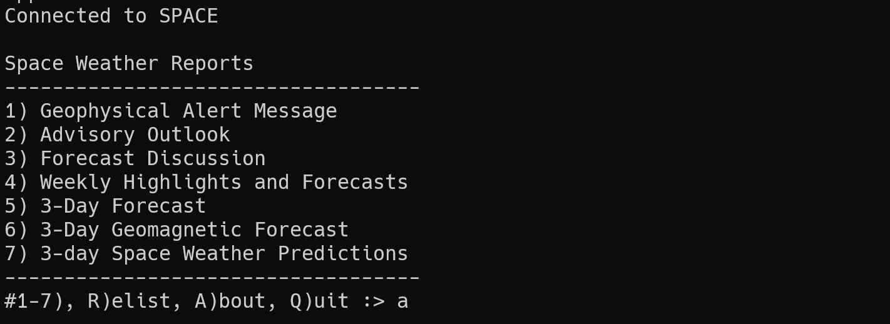

# BBS Apps
These following applications should be able to be run stand-alon or by a BBS. See below for notes on the purpose, setup and usage of the individual applications.

hamqsl.py
---------
**Type**: Python  
**Purpose**: HF Propagation  
**Information source**: www.hamqsl.com, used by permission of author Paul n0nbh  
**Developer**: Brad Brown KC1JMH

qrz3.py
-------
**Type**: Python  
**Purpose**: QRZ lookup  
**Information source**: qrz.com   
**Developer**: Modified code from github.com/hink/qrzpy  
**Notes**: Requires XML subscription and API key, unless you are prompting visitors for their QRZ creds (in plaintext over the air or local)

space.py
--------
**Type**: Python  
**Purpose**: NOAA Space Weather reports  
**Information source**: Space Weather Prediction Center, National Oceanic and Atmospheric Administration  
**Developer**: Brad Brown KC1JMH

sysinfo.sh
----------
**Type**: Shell script  
**Purpose**: Get host information and confirm BBS services are running  
**Information source**: localhost  
**Developer**: Brad Brown KC1JMH  
**Notes**: Requires neofetch be installed  

wx.py
-----
**Type**: Python  
**Purpose**: Local weather reports to Southern Maine and New Hampshire  
**Information source**: National Weather Service, Gray Office  
**Developer**: Brad Brown KC1JMH

# ToDos
[X] **All** - Update #! to call interpreter regardless of location using env  
[ ] **qrz3.py** - Add variable check so as to not require sysop to comment lines if used in the mode that requires user login  
[ ] **wx.py** - Expand to provide weather information for other areas, in the meantime the txt web requests may be updated to pull any URL.